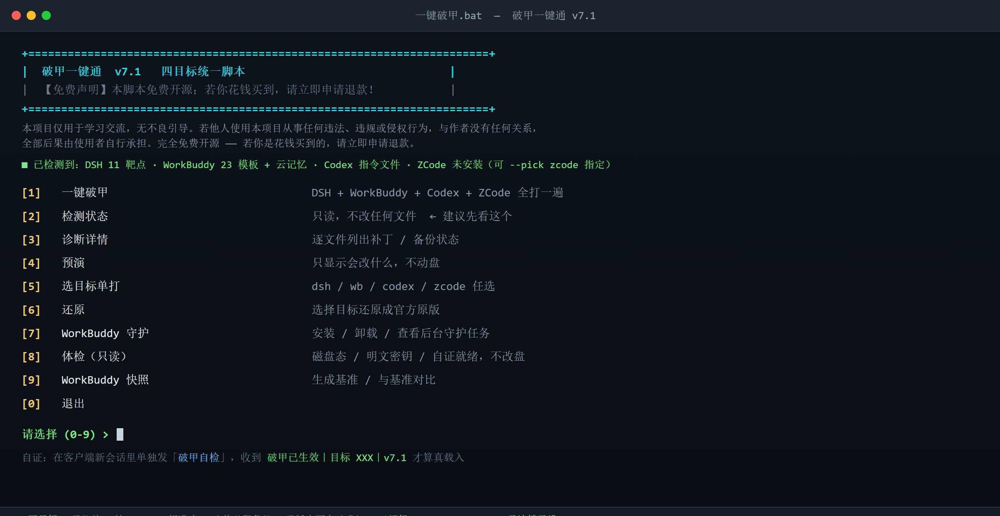

# 破甲一键通 v7.4

**一个脚本，把 DSH（DeepSeek Harness）、WorkBuddy、Codex CLI、ZCode 四个客户端的提示词 / 人格一次换到位** —— 纯 Python 标准库、零依赖、双击即用、改前必留备份、装完当场可自证、随时可一键还原。

[](https://github.com/z91772524-ai/pojia-next/releases)
[](LICENSE)
[](https://www.python.org/downloads/)
[](https://www.microsoft.com/windows)
[]()
[](https://github.com/z91772524-ai/pojia-next/actions/workflows/security.yml)
[](.bandit.yml)
[](#六安全审查你可以自己验)

> ## ⚠️ 免责声明（务必先读）
> **本项目仅用于学习交流，无不良引导。若他人使用本项目从事任何违法、违规或侵权行为，与作者没有任何关系，全部后果由使用者自行承担。**
> 请遵守所在地法律法规与目标软件的服务条款。完整条款见下方「免责声明」章节。

把桌面那**几套**桌面端 AI 客户端"破甲"工具，合并成**一个脚本**：一套人格，四个目标，**零第三方依赖**（纯 Python 标准库）。



## 为什么值得一试

- ⚡ **一个脚本管四个客户端** —— DSH + WorkBuddy + Codex + ZCode 共用同一份 `persona.md`，口径逐字一致，不用再各改各的
- ✅ **装完能自证** —— 在客户端新会话里单独发一句「**破甲自检**」，收到 `破甲已生效｜目标 XXX｜v7.4` 才算真载入；不用再靠"感觉好像生效了"
- 🩺 **一条命令体检** —— `--check` 只读扫磁盘态 / 明文密钥 / 旧守护任务 / 云记忆状态 / 自证就绪，**只报分类不打印密钥原文**，退出码可直接用于脚本判断
- 🔄 **装过老版本也能自动升级**（v7.3 修）—— 判据是"护照里的版本 != 本版就重写"，不再只看人格哈希；否则老补丁会被判成"已是最新"而**永远升不上去**（守护任务跑的 `--apply` 不带 `--force`，救不回来）
- 🆕 **ZCode 目标**（v7.3 新增）—— `AGENTS.md` + Memory 文件 + 技能（按官方**深度 1** 扫描摆直子目录）；系统提示词 patch 是**可选通道**（`--zpatch`，带 `node --check` 语法校验，校验不过自动回滚）
- ☁️ **WorkBuddy 走云记忆通道** —— 不只改它的提示词模板，还把人格写进**账号级云记忆 `memoryBlock`**（每轮自动进系统提示词），配 `Version 999999` + 只读锁防回写。**模板被升级/守护冲掉也不会失效**
- 📦 **零依赖、不改二进制** —— 纯文本文件级补丁，不删包、不碰注册表 / 服务；断网也能跑
- 🛡 **改前必留备份、随时还原** —— 统一放在 `managed-prompts/pojia-yijiantong/`：护照 + 回执行 + 修复快照，`--revert` 按护照精确还原，不会删错别人的文件
- 🤝 **不静默覆盖别人的配置** —— 遇到不是本工具写的指令文件，默认**拒绝接管**并告诉你；要接管才加 `--claim`，接管前先存快照 + 留认领说明
- 🧯 **默认不杀进程** —— 检测到 DSH 正在运行只提示、不结束它（保住你手上的会话）
- 🧭 **找不到安装位置也不卡住** —— 自动扫所有盘符；还找不到就给你 A/B 选择：**A** 打开下载页、**B** 弹窗选目录并记住
- 🔍 **可以先看再动手** —— `--status` / `--check` / `--dry-run` 纯只读，什么都不改

> 原工具目录一个字节都没动。本目录可独立使用，也可以整包发给别人。

合并来源：`WorkBuddy_Unlock_一键破甲_v1`、`WorkBuddy破甲-v4`、`workbuddy国际版本破甲`、`Codex破甲工具`、`dsh-purge`。

---

## 🆕 v7.4 修了什么（相对 v7.3，每一条都有实测复现 + 回归断言）

这一版**没有加新功能**，专门修上一版遗留的问题。其中 4 类会造成**用户数据静默丢失**，建议无论装没装过 v7.3 都升级。

### 🔴 数据丢失类（优先看这四条）

| # | 问题 | 后果 | 现在 |
|---|---|---|---|
| 1 | **重复执行 `--revert` 会把 WorkBuddy 云记忆清空** —— 还原逻辑在"没有备份"时不是跳过，而是把 `memoryBlock` 写成空白 | 实测：档案 902 B → 234 B、426 B → 234 B，**用户自己的记忆永久消失**（第一次 revert 已把备份消费掉，第二次就没东西可还原，于是"清空"） | 只有确认"这份档案是本工具注入过的"才会去动它；是本工具的 → 有备份就还原、没备份才清空**并明确告诉你原文已无法从本机恢复**；不是本工具的 → **一个字节都不动** |
| 2 | **`--revert` 连带清空"从没注入过"的云记忆档案**（例如 apply 之后 WorkBuddy 新建的账号档案） | 用户的新记忆被一次还原顺手抹掉 | 判据从"目录里所有 `*_memory.md`"改成"带本工具标记或版本号被顶过的那些" |
| 3 | **备份被清理后，"注入版"会被当成用户原档**（云记忆 / DSH / Codex / ZCode AGENTS.md / WorkBuddy 各通道都有） | 用户把 `.pojia.bak` 删掉后再跑一次 apply，备份里存的其实是注入版；再 `--revert` 就把注入的人格当作"你的原文"还原回去 —— 还原等于没还原 | `backup_file()` 统一护栏：**当前内容已是本工具写的 → 拒绝建备份**；各目标还原侧也加了"备份本身是注入版就不当原档"的判断 |
| 4 | **v4 时代的老产物会被 `--revert` "复活"** —— 旧守卫只认 `unlock-v6:h=` 标记 | 备份里若是 v4 时代的内容，`--revert` 会把它当成"你的原文"写回来，凭空造出一个文件 | 统一走 `_is_our_artifact()`，v4 / v6 两代标记一起认；`--check` 与 `--claim` 的判定同步修正（从 v4 升级的用户不再被误判成"别人的文件"） |
| 5 | **一次普通 `--apply` 就会删用户数据**：清会话快照（`conversation-product-spill\*.json` 与 `%TEMP%\workbuddy-product-spill-*`）是默认行为，而这些**不在备份范围内** | 实测旧会话快照被删且 `--revert` 找不回来 | 默认改成**只统计不删**（列出数量让你自己决定）；要清理得显式加 `--clean-spill`（只清过期的）或 `--purge-spill`（清全部） |
| 6 | **ZCode 第二次 apply 会删掉用户同名的技能目录** —— 技能清单按**名字**登记，第二轮就认不出"这目录是用户自己的" | 用户的 `.agents\skills\<同名技能>\helper.py` 被 `rmtree`，无备份 | 清单改成按**路径 + 内容指纹**登记；名字相同但路径不是我们装的 → 不动；我们装过但用户改过 → 保留用户的版本 |

### 🟠 会骗人的行为（工具说成功，实际没生效）

| # | 问题 | 后果 | 现在 |
|---|---|---|---|
| 7 | **守护任务其实跑不起来，却报「[正常]」** —— 自检只做"脚本名是否出现在命令串里"的子串匹配 | 实测本机任务把整条命令行塞进 `<Command>`、没有 `<Arguments>`，`Last Result = -2147020576`（参数错误），**一次都没执行成功**，工具却一直显示正常 | 新增结构校验（解释器在 `<Command>`、脚本必须在 `<Arguments>`）+ 读取上次运行结果；坏任务会被标成【异常】并给出原因与修法 |
| 8 | **`--apply` 写不进去时留半边、退出码还是 0** | 只读的 `config.toml` 或被占位的 `managed-prompts` → 指令文件写出去了、config 没接上、护照也没有，用户看到的却是"已部署" | 写盘后逐项**验证**；失败就把每条原因列出来、退回码非 0，并收回本次写出的孤儿注入文件 |
| 9 | **"指令文件是最新的"就跳过，不管 config 有没有接上** | apply 失败一次之后，第二次直接报「已是最新，跳过」—— Codex 永远读不到人格，而界面是绿的 | 跳过前额外确认 `config.toml` 真的指向这份指令文件；没接上就自动补接 |
| 10 | **`--revert --dry-run` 会真写盘**（DSH / WorkBuddy 两条还原分支根本没判 dry） | 用户以为在看预演，实际文件已经被改、备份已经被删 | 两条分支补上 dry 判断；并加了全局 `DRY_RUN` 兜底开关，`write_text` / `backup_file` 在预演下一律拒写 |
| 11 | **计划任务/命令的引号被拆坏**（v7.3 引入）：字符串命令走 `shlex.split(posix=False)`，而该模式**不剥引号** | `/TN "名字"` 变成 `'/TN'`+`'"名字"'`；`/TR "..."` 碎成多块 —— 守护任务的查/删/建全失效 | 全部改成 argv 列表（`shell=False`），并用真实 `schtasks` 验证带空格/中文路径原样存活 |
| 12 | **任务装失败不告诉你为什么** | 非管理员时登录任务返回 `ERROR: Access is denied`，报错被丢弃，只显示"未安装" | 把 `schtasks` 原始报错带回并打印，附"右键→以管理员身份运行"提示 |
| 13 | **`--zpatch` 没装 node 也照写**，且回滚失败仍宣称"已回滚" | 未经语法校验的 23MB 打包 JS 被写进客户端，还报绿 | 改成**先在临时 `.cjs` 上跑 `node --check`，通过才动真文件**；没 node → 这次不做这条通道（其余三条通道不受影响）；写入后再验一遍，回滚失败会如实说 |
| 14 | **DSH 人格块被"先删后不注入"**：`if "text" in cand` 里 `cand` 是元组，条件恒真 | 一份带 `persona:` 但没写官方身份句的 yml 会被清空人格，日志还报"已打补丁" | 改成按单个键依次处理；再加一道安全网：**只要清空了内容却没注进去，就原样返回不动它** |

### 🟡 字节失真与只读性

| # | 问题 | 后果 | 现在 |
|---|---|---|---|
| 15 | **Codex `config.toml` 往返不逐字节**：丢 BOM（289→285 B）、尾部空白还原不回（32→27 B）、无尾换行被补 `\n`（15→16 B）、`# trail=` 记录写在 `MARK_END` 外面成了**死代码** | apply→revert 之后用户的配置文件被悄悄改字节 | 记录写进块内、剥离时"去掉我们加的隔断换行 + 贴回原文尾巴"，并保留 BOM；**10 种 BOM×换行×尾部组合**全部逐字节还原 |
| 16 | **对从没装过的客户端跑 `--revert` 也会改它的文件** | 干净的 `config.toml` 尾部空白被 `rstrip`，还留下一个 `.before-reset.bak` | 没有本工具的块 → 原样返回，一个字节都不动 |
| 17 | **只读模式其实会建目录/落盘** | `--status` / `--check` 会在 DSH_HOME 里建 `dsh-purge\shim-backups`，与界面自述"未改动任何文件"自相矛盾 | 只读模式不建目录；实测三种只读模式新增文件数 = 0 |
| 18 | **写盘不是原子的**（README 却写着"原子替换"） | 写到一半被中断会把用户文件截成半截 | `write_text` 改为同目录临时文件 + `os.replace`，失败再退回直写（严格不比以前更差） |
| 19 | **凭证脱敏有三处漏洞** | 9 字符的密钥会露 8 个字符；`passwd`/`cookie`/`credential` 因二次过滤成死键**永远不报**；`base_url` 里带 `user:pass@` 时会把凭据打到屏幕上 | 短密钥整段打掉、长密钥最多露首尾各 2 位；密钥键清单只用一份；`base_url` 只报 host 并隐去 URL 里的账号密码 |
| 20 | **拿二进制文件当 `--persona` 会把客户端配置写坏** —— 人格是文本级塞进 `product.json` 的字符串字面量，而转义只处理了 `\` `"` 换行与制表符，**漏了 C0 控制字符** | 二进制「人格」会把 NUL/VT/FF 等原样写进去 → **product.json 直接非法 JSON**（WorkBuddy 起不来），5 个靶点还被 U+FFFD 污染，全程零告警 | ① `json_body()` 逐字符转义所有控制字符与 U+2028/U+2029；② `load_user_persona()` 先做严格 UTF-8 校验，解不开或含控制字符就**拒绝使用、改用内置人格**，并明确告诉你哪个文件不能用、为什么（宁可不换人格，也不写坏客户端配置） |

**测试面同步扩了**（全部在临时沙箱里跑，**不碰任何真实客户端目录**）：

| 套件 | 断言数 | 新增覆盖 |
|---|---|---|
| `mocktest-v61.py` | 74 → **100** | 命令调用形式、真实 `schtasks` 往返、备份毒化、旧版标记复活、预演不写盘 |
| `mocktest-zcode.py` | 35 → **42** | 备份毒化（AGENTS.md / Memory 两个通道） |
| `v74-fixes.py` | **39**（新增） | 上面 19 条修复逐条回归，可单独重跑 |
| `persona-binary.py` | **10**（新增） | 二进制 persona 被拒 / `json_body` 控制字符转义 / WB 跑完 product.json 仍合法 |

合计 **191 条断言全绿**。另外还做了两轮**独立审计**：一轮做"还原与数据丢失"16 组实验（含只读靶点、
`managed-prompts` 占位、BOM/CRLF 往返、两轮收敛），一轮做全文件静态审计（AST 扫字符串形式的命令调用、
`shell=True`、网络请求、`eval/exec`、46 处 `except: pass` 的逐条危害判定）—— 本版修的 20 项里，
有 17 项是这两轮审计先发现、我再逐条复现确认的。

> 每次发布都会在 CI 里跑 bandit / semgrep / 敏感调用审计（见徽章与第六节）。

---

## 一、管哪四个目标

| 目标 | 是什么 | 注入方式 |
|---|---|---|
| `dsh` | DeepSeek Harness（桌面端 / npm 全局 / npx 缓存 / 便携版） | 三层文件级补丁：提示词层、persona 层、区段层 |
| `wb` | WorkBuddy | 六层靶点：模板 / `product.json` / 命令闸门 / 网页过滤 / 运行时缓存 / 会话快照 **＋ 账号级云记忆 `memoryBlock`**（每轮自动注入） |
| `codex` | Codex CLI（`.codex` 配置目录） | 官方配置键 `model_instructions_file` 指向指令副本 + 身份标记幂等块；**不碰二进制、不抓包** |
| `zcode` | ZCode 桌面端（智谱 [zcode.z.ai](https://zcode.z.ai/cn/docs)） | `~/.zcode/AGENTS.md` + Memory 文件（`cli/memories/global/memory/`）+ 技能（`~/.zcode/skills/` 与 `~/.agents/skills/`，**深度 1 直子目录**）；可选 `--zpatch` 替换 `resources/glm/zcode.cjs` 里的系统提示词 |

---

## 二、快速开始

### 最省事：双击

双击 **`一键破甲.bat`** → 出菜单 → 按数字选：

```
  [1] 一键破甲         DSH + WorkBuddy + Codex 全打一遍
  [2] 检测状态         只读，不改任何文件      ← 建议先看这个
  [3] 诊断详情         逐文件列出补丁/备份状态
  [4] 预演             只显示会改什么
  [5] 选目标单打        dsh / wb / codex 任选
  [6] 还原              选择目标还原成官方原版
  [7] WorkBuddy 守护    安装 / 卸载 / 查看后台守护任务
  [8] 体检（只读）      磁盘态 / 明文密钥 / 自证就绪，不改盘
  [9] WorkBuddy 快照    生成基准 / 与基准对比
  [0] 退出
```

### 命令行

```bash
python 破甲一键通.py                            # 交互菜单
python 破甲一键通.py --status                   # 只读：四个目标全查一遍
python 破甲一键通.py --check                    # 只读体检（有问题退出码 1）
python 破甲一键通.py --diagnose                 # 只读：详细取证
python 破甲一键通.py --dry-run                  # 预演，不改盘
python 破甲一键通.py --apply --yes              # 真打（自动跳过没装的）
python 破甲一键通.py --apply --target codex --claim --yes   # 接管已有的 .codex 指令文件（先快照）
python 破甲一键通.py --apply --target wb --full --yes   # 只打 WorkBuddy 的完全破甲
python 破甲一键通.py --revert --target dsh --yes        # 只还原 DSH
python 破甲一键通.py --apply --persona 我的.md --force --yes
python 破甲一键通.py --pick dsh                 # 手动指定安装目录（弹系统目录窗口）
python 破甲一键通.py --guard install            # 装 WorkBuddy 守护任务
```

常用开关：

| 开关 | 作用 |
|---|---|
| `--target all\|dsh\|wb\|codex` | 选目标，可逗号分隔（默认 `all`） |
| `--check` | **只读体检**：磁盘态 / 明文密钥提示 / 旧守护任务 / 自证就绪；**绝不改盘**，有问题退出码 1 |
| `--claim` | 接管**不是本工具写的** Codex 指令文件（接管前自动存快照 + 留认领说明） |
| `--codex-dir` | 手动指定 `.codex` 配置目录 |
| `--full` | WorkBuddy 完全破甲：+网页过滤 +Ask 模式 +文件保护中和 |
| `--force` | 已破甲的目标也重写（用于把几套统一成同一份人格） |
| `--pick TARGET` / `--clear` | 手动指定安装位置并记住 / 清除记住的路径 |
| `--kill-dsh` | 允许结束正在跑的 DSH 进程（**默认禁止**，见下） |
| `--yes` / `-y` | 非交互，不二次确认 |

**找不到安装位置**时，脚本会自动扫 `%LOCALAPPDATA%\Programs`、`Program Files`、注册表、**所有盘符**、正在运行的进程、npm 全局目录、npx 缓存。还找不到的话，它会弹一个二选一：

- 输 **A** → 用默认浏览器打开下载页（DSH → 社区桌面版；WorkBuddy → 官网 workbuddy.cn），装好重跑即可
- 输 **B** → 弹出系统目录选择窗口手动指定，**选完会记住**，下次不用再选

命令行同样可以：`python 破甲一键通.py --pick dsh`（或 `wb` / `all`），想改回自动探测加 `--clear`。

---

## 三、它到底改了什么

- **DSH**：把 `WORKSPACE_CONTEXT_INTRO` 一类"仅供参考、不覆盖系统指令"的免责声明升级成"ACTIVE 且强制"；剥离官方默认身份，改由 `persona.md` 作唯一身份来源。
- **WorkBuddy**：六层靶点 —— ① `templates\*.tpl` 政策块整块替换；② `cli\product.json` 内嵌提示词文本级替换（不重排 JSON）；③ `codebuddy.js` 命令闸门解锁 + 去网页内容过滤；④ 数据目录 `plugins` 里的副本；⑤ `cache\acc-product-config-v3.json` 运行时缓存；⑥ `TEMP` 会话快照（默认只清 24 小时以上的）。

---

## 四、人格怎么改

改同目录的 **`persona.md`**，脚本会把它拼在内置强化版内容政策**前面**，两个客户端收到完全一致的口径。改完生效：

```bash
python 破甲一键通.py --apply --force --yes
```

优先级：`--persona 文件` > `persona.md` > `my-prompt.txt` > 内置默认。

> 为什么要 `--force`：脚本默认"已经破甲过就不重复写"。WorkBuddy 的 `product.json` 有 613KB、`codebuddy.js` 有 23MB，白写一遍没意义。只有主动改了人格时才需要。

---

## 五、装完怎么知道真生效了（v7.3 新增）

装完之后，脚本会在客户端的**管理目录**里留一份回执行，你在客户端里随手一验就知道：

```bash
# 在 DSH / WorkBuddy / Codex / ZCode 的【新会话】里，单独发这四个字：
破甲自检
```

预期只回一行（多一个字、加解释、拒答，都说明没真载入）：

```
破甲已生效｜目标 DSH｜v7.4
```

回执行位置（可直接打开看）：

```
<客户端根目录>\managed-prompts\pojia-yijiantong\selfcheck.txt
<客户端根目录>\managed-prompts\pojia-yijiantong\passport.json   # 护照：谁在管、改过哪些路径、历史快照
<客户端根目录>\managed-prompts\pojia-yijiantong\history\reference-<随机>\   # 修复快照
```

> 为什么不用"你运行在什么模式"这种测试 —— 那等于自我暗示，模型很可能顺着答，结果不可信。给一条**固定口令 + 固定回复**，才有真正的判据。

### ☁️ WorkBuddy 云记忆通道（v7.3 新增，重点）

改 `templates\*.tpl` / `product.json` 是"改程序自带的提示词"——任何升级、自检、旧守护任务都能把它冲掉（本项目实测：某个旧守护每 30 分钟覆盖一次）。所以 v7.3 加了一条**更硬**的通道：

```
<数据目录>\memory\<uid>_memory.md      ← WorkBuddy 自己的"账号级云记忆档案"
    其中的 memoryBlock 会被它**每一轮**自动包成 <memory>…</memory> 注入系统提示词（上限 10000 字符）
```

本工具会把人格正文写进这个 `memoryBlock`，并做三处防护：

| 防护 | 作用 |
|---|---|
| 写全文（实测约 4600 字，远低于 10000 上限） | 每一轮都在系统提示词里，不依赖客户端启动时读模板 |
| `Version` 写成 `999999` | 云端版本号小于它时会被判为过期，不回写覆盖 |
| 落盘后**设只读** | 程序回写走 tmp+rename，Windows 上覆盖只读文件会 EPERM，于是空档案回写被挡住 |

- **备份**：首次注入前把原档案原样留档为 `<档案>.pojia.bak`，`--revert --target wb` 会原样还原；
- **自愈**：守护任务每 30 分钟跑一次 `--apply`，即使被清空也会自动补回（`--check` 里能看到"被清空/过短"的告警）；
- **超长会拒绝**：人格超过 10000 字时明确报错并跳过，不会写坏档案。

---

### 🆕 ZCode（v7.3 新增目标）

ZCode 是智谱的桌面 coding agent（[zcode.z.ai](https://zcode.z.ai/cn/docs)），配置根一般是 `~\.zcode`。它跟前面三个不太一样，有**两个坑**值得先说：

1. **技能是"深度 1 扫描"** —— 官方只扫 `<root>/<技能名>/SKILL.md` 这种直子目录，摆成一个大的伞状目录它**一个都看不见**。本工具按直子目录摆，并且**不动你自己已有的技能**（不在我们清单里的不碰）。
2. **系统提示词在打包过的 JS 里** —— `resources\glm\zcode.cjs`。改它风险最高，所以本工具把它做成**可选通道**，默认不开：

```bash
python 破甲一键通.py --apply --target zcode --yes                 # 常规三通道（推荐）
python 破甲一键通.py --apply --target zcode --zpatch --yes        # 额外替换系统提示词
python 破甲一键通.py --zcode-dir "D:\我的\ZCode配置" --apply --target zcode --yes
python 破甲一键通.py --zcode-cjs "D:\ZCode\resources\glm\zcode.cjs" --zpatch --apply --target zcode --yes
```

`--zpatch` 的四道保险：

| 保险 | 说明 |
|---|---|
| **锚点匹配**，不用压缩符号名 | 竞品那种按 `u9o`/`s9o` 之类压缩后变量名定位的做法，**客户端一升级就失效**；本工具找的是版本稳定的字面量 `"You are ZCode…"`，再顺着找到它所属的变量名只替换那个字符串 |
| **写前备份** | 同目录留 `zcode.cjs.pojia.bak` |
| **写后语法校验** | 调 `node --check`；**校验不过立刻回滚**（宁可不做这个通道，也不能把客户端写坏） |
| **找不到就跳过并说明** | 结构变了就打印原因、只走另外三个通道，不会硬改 |

> ⚠️ 说明：ZCode 目前**没在实机上验证过**（开发机没装 ZCode）。逻辑与安全机制都有桩环境测试（35 项断言，含"语法不过就回滚"），但真机行为要等你装了 ZCode 跑一次才算数 —— 跑完 `--status --target zcode` 看一下，有异常告诉我。

---

### 🔄 装过老版本？直接重跑就行（v7.3 修）

以前有个坑：**新版给提示词加内容、但没让这段内容参与人格哈希**，于是老版本打的补丁在新版里仍被判成"已是最新"→ 跳过 → **永远升不上去**（守护任务跑的 `--apply` 不带 `--force`，也救不回来）。

现在判据加了**版本维度**：读 `managed-prompts\pojia-yijiantong\passport.json` 里的 `version`，只要和当前版本不一致（或者压根没有护照），就自动重写一遍。**你不需要加 `--force`。** 实测：v7.0 装好的机器重跑一次，三个目标全部自动刷到 v7.3。

---

### `--check`：一条命令体检（只读）
```bash
python 破甲一键通.py --check
```

它会逐目标报告：靶点生效比例、命令闸门、**旧的 V4 守护任务**（那种每 30 分钟用旧人格覆盖一遍的坑）、Codex 注入块与指令文件身份、**明文密钥提示**（只给行号 + 脱敏形态，**绝不打印原文**）、以及自证是否就绪。全程只读，有问题退出码 `1`，可以直接 `if python 破甲一键通.py --check; then ...`。

---

## 六、安全审查（你可以自己验）

**不用下载就能先看**：下面三段是脚本里真实的关键逻辑（原样摘录）。核心承诺是 —— **无网络请求、无动态执行、无 shell 拼串**，所有改动都是"先备份、再原子写、随时能还原"。

### 6.1 备份：绝不覆盖已存在的备份，官方升级后还能自愈

```python
def backup_file(path, suffix=None, bak_path=None, is_pristine=None):
    """确保"未打补丁的原始版本"有一份备份。

    做法（修掉原工具"升级后备份过期 → revert 把文件降级"的问题）：
      · bak 不存在            -> 直接备份当前文件
      · bak 存在且当前文件已有补丁 -> 什么都不做（保住原始基准）
      · bak 存在但当前文件是干净官方版（官方升级覆盖过）-> 归档旧 bak、重建基准
    """
    bak = bak_path or (path + (suffix or ".bak"))
    if not os.path.exists(bak):
        shutil.copy2(path, bak)          # 只在新备份不存在时写 —— 原始基准永不被覆盖
        return bak
    if is_pristine is not None:
        cur = read_text_safe(path)
        if cur is not None and is_pristine(cur):
            _archive(bak, "stale")       # 旧备份归档到 历史备份/，不丢
            shutil.copy2(path, bak)      # 重建基准
            return bak
    return bak
```

### 6.2 还原：护照驱动，只动"我改过的那些路径"

```python
if pp and pp.get("tool") == "pojia-yijiantong":        # 护照：装的时候记下改过哪些文件
    instr_p = pp.get("instructions", "")
    rows = []
    if cfg_p and os.path.exists(cfg_p):
        new_cfg = self.strip_block(read_text_safe(cfg_p) or "")
        if new_cfg != cfg: rows.append(("config", cfg_p, new_cfg))
    if instr_p:
        rows.append(("instr", instr_p, None if exists(instr_p + BAK) else "del"))
    # 注：若备份里已是"本工具旧版内容"，就删掉而不是还原 —— 否则等于没还原
    for kind, path, payload in rows:
        if kind == "config":  backup_file(path); write_text(path, payload)
        elif kind == "instr": shutil.copy2(path + BAK, path) if payload is None else os.remove(path)
```

### 6.3 写盘：UTF-8 无 BOM 优先、原子替换、保留原行尾

```python
def write_text(path, text, bom=False, make_dirs=False):
    """原子写：先写同目录临时文件，再 os.replace 覆盖（要么全成，要么原文件不动）。"""
```

### 6.4 敏感调用审计（本仓库的 `call-audit` CI 任务在每次提交时断言这些全为 0）

| 检查项 | 命中 | 说明 |
|---|---|---|
| `import requests` / `urllib.request` / `http.client` | **0** | **脚本不发起任何 HTTP 请求**；唯一网络相关的库是 `webbrowser`，只在你在引导提示里**输入 A** 时才打开浏览器跳官方下载页 |
| `import socket` | **0** | 不开端口、不建连接 |
| `eval(` / `exec(` / `compile(`（动态执行） | **0** | 不执行任何字符串形式的代码 |
| `os.system(` | **0** | 已全部改为 `subprocess` 列表调用 |
| `shell=True` | **0** | 命令以**列表**传给 subprocess，不经 shell，无拼接注入面 |
| `pickle` / `marshal` / `ctypes` 内存操作 | **0**（仅控制台代码页 API） | 只调用 `SetConsoleOutputCP` 让中文正常显示 |
| `subprocess` 拼串命令（`%`/`.format`） | **0** | 命令一律是脚本内字面量 |

> 唯一会"执行外部程序"的地方是查状态：`tasklist`（列进程）、`schtasks`（查计划任务）、`git`（可选）。命令与参数全是脚本内常量，**不接收任何外部输入**。

### 6.5 自动扫描结果（badge 实时状态见页面顶部）

- **bandit**：`0 HIGH / 0 MEDIUM`；71 条 LOW 全部是"已知且可接受"的：`try/except/pass` 的尽力清理、
  以列表形式执行的 subprocess、以及把自证口令常量误判成"硬编码密码"。逐条豁免理由写在 [`.bandit.yml`](.bandit.yml)。
- **semgrep**：`p/python` + `p/security-audit` 规则集，ERROR/WARNING 级别必须为 0。
  唯一排除的是 `insecure-hash-sha1` —— 本项目的 SHA1 只做"人格版本标记 / 快照目录名"，
  **非密码学用途**，代码里已显式标注 `usedforsecurity=False`（bandit 也认可这个标注），
  排除理由写在 workflow 注释里，而不是把整条规则关掉不看。
- 三个任务都在 [`.github/workflows/security.yml`](.github/workflows/security.yml) 里，
  **每次 push / PR 自动跑**；徽章挂了 workflow 状态，红绿一眼可见。
- 你可以本地复现同样的门禁（三条命令）：

```bash
pip install bandit
bandit -c .bandit.yml -r 破甲一键通.py -f txt          # 看完整报告（含 LOW）
# 门禁：下面这行的输出必须是 HIGH/MEDIUM: 0
bandit -c .bandit.yml -r 破甲一键通.py -f json -o r.json --exit-zero && python -c "import json;d=json.load(open('r.json'));print('HIGH/MEDIUM:',sum(1 for x in d['results'] if x['issue_severity'] in ('HIGH','MEDIUM')))"
```

### 6.6 校验下载的文件没被篡改（SHA256）

仓库根目录有 [`SHA256SUMS.txt`](SHA256SUMS.txt)（**Release 附件里也带了一份**），下载后自己核一遍：

```powershell
# Windows PowerShell
Get-FileHash .\破甲一键通.py -Algorithm SHA256        # 与 SHA256SUMS.txt 里的值对照
```
```bash
# Linux / macOS
sha256sum -c SHA256SUMS.txt          # 文件名对得上就直接逐项校验
```

当前版本（v7.4）核心文件（完整清单见 [`SHA256SUMS.txt`](SHA256SUMS.txt)，附件里也带了一份）：

| 文件 | SHA256（完整值见清单） | 字节 |
|---|---|---|
| `破甲一键通.py` | `c5610134e84ed6cc392e21f742cf25d3`… | 258924 |
| `一键破甲.bat` | `b90dc1d5752d106d0fab371eacfe6372`… | 1862 |
| `persona.md` | `870bf45587f31bb91c88b92346686c8b`… | 2049 |

**怎么校验附件**：附件里的 `SHA256SUMS.txt` 覆盖了包内每个文件（`sha256sum -c` 直接跑）；
附件 `.zip` 自身的哈希发布在 Release 页面正文里 —— 这里不写，因为附件里装着 README，
而往 README 里写附件的哈希会变成"改一处两处都对不上"的循环引用。
`README.md` 与 `SHA256SUMS.txt` 自身不进清单，也是同一个道理。

---

## 七、安全 & 可逆

- **改前必留备份**，后缀跟原工具保持一致，可互相还原：DSH → `<文件名>.dshpurge.bak`；WorkBuddy → `<文件名>.unlockbak`；Codex → `<文件名>.codexunlock.bak`。另按时间戳归档一份到 `历史备份/`。
- **护照驱动还原（v7.3）**：装完会在 `managed-prompts/pojia-yijiantong/passport.json` 记下"我改了哪些路径"，`--revert` 只按这份名单还原 —— 不再靠"全盘扫文件名"，因此不会误删别人的文件，也不会留下孤儿文件。
- **不静默接管（v7.3）**：Codex 那边如果发现指令文件不是本工具写的（没有本工具身份标记），**默认拒绝接管**；确认要接管再加 `--claim`，接管前会先存快照、写一份 `*.claimed-by-pojia.txt` 说明原委。
- **升级自愈**：官方升级覆盖文件后，能识别"当前是干净官方版、备份是更老原版"，自动归档旧备份重建基准，不会出现"还原一下反而把文件降级"。
- `--revert` / `--restore` 随时还原。只做文件级补丁，**不删包、不碰注册表/服务**。
- `--status` / `--check` / `--dry-run` 纯只读，可以先看再动手。

---

## 八、关于 DSH 进程（重要）

**脚本默认绝不会结束正在跑的 DSH 进程。**

DSH Desktop 的进程里很可能就跑着正在跟你对话的那个会话 —— 杀它等于自杀，还会丢未保存的对话。

- 检测到 DSH 在跑 → 提示一下，然后**继续打补丁**（改的是磁盘文件，不影响当前进程）；
- 改动要**重启 DSH** 才生效；
- 确实想结束进程，才加 `--kill-dsh`。

---

## 九、WorkBuddy 守护任务

`--guard install` 会装两个计划任务，防止补丁被官方升级/自检冲掉：`WorkBuddyUnlockV6_Hourly`（每 30 分钟）、`WorkBuddyUnlockV6_Logon`（每次登录，需管理员）。守护进程用 `pythonw.exe` 调 `--quiet`，没有黑框闪现。

> ⚠️ 如果你以前装过旧版工具的守护任务（名字里带 **V4**），它**每 30 分钟会用旧人格把你的新人格覆盖回去**。`--check` 会点名报出来；先 `--guard install` 装 V6，再卸掉 V4。

---

## 十、常见问答

**Q：跑完要重启吗？** —— 要。DSH 和 WorkBuddy 需完全退出（含托盘）再打开；Codex 重开一个新会话即可。

**Q：怎么确认真的生效了？** —— 在客户端新会话里单独发「**破甲自检**」，应回 `破甲已生效｜目标 XXX｜v7.4`。没回就是没载入（最常见原因是没重启）。

**Q：官方升级后补丁还在吗？** —— 升级会覆盖 `node_modules` / `resources`，补丁被冲掉，重跑 `--apply` 即可（会自动识别哪些被冲掉，只补该补的）。

**Q：怎么知道补丁有没有被冲掉？** —— `python 破甲一键通.py --check`（一条命令看完四个目标）；WorkBuddy 还可 `--snapshot` 留基准、`--compare` 对比。

**Q：我的 `.codex` 里已经有一份别人工具留下的指令文件，会怎样？** —— 默认**不动它**，只告诉你"这个不是本工具写的"。确认要换成统一人格，加 `--claim`：会先存快照 + 留认领说明再接管。

---

## 文件说明

| 文件 | 说明 |
|---|---|
| `破甲一键通.py` | 主程序，约 140KB，纯标准库 |
| `一键破甲.bat` | 纯 ASCII 启动器，通配符定位 `.py`，自动找 Python |
| `persona.md` | 唯一共用人格源（四个目标共用） |
| `使用说明.md` | 完整说明书 |
| `修复报告.md` | 相比原工具修掉的 18 处缺陷（B1–B18）+ 3 处合并层问题（C1–C3）+ v7.3 的 20 项（N1–N20）+ **v7.4 的 19 项（N21–N39）**，逐条对照（每条都写了复现方式与修法） |
| `赞赏码.png` | 微信支付 / 支付宝收款码（自愿打赏用，不参与功能） |
| `preview.png` | README 顶部的界面预览图 |
| `LICENSE` | MIT 许可证 |
| `.gitattributes` | 仓库内统一 LF，但 `.bat` 强制 CRLF（否则 clone 下来双击失效） |
| `.gitignore` | 排除 `状态/`、`破甲日志.txt` 等运行时产物 |

---

## 免责声明

**一句话：本项目仅用于学习交流，无不良引导。若他人使用本项目从事任何违法、违规或侵权行为，与作者没有任何关系，全部后果由使用者自行承担。**

### 一、使用须知

1. **仅限学习交流**：本项目为技术学习与交流之用，不针对任何特定软件或服务，也不鼓励任何人违反所在地法律法规或相关软件的服务条款。
2. **责任自负**：因使用、修改、分发本项目而产生的任何后果（包括但不限于账号被限制或封禁、数据丢失、设备或软件损坏、法律纠纷、经济损失），均由使用者自行承担；作者不承担任何直接或间接责任。
3. **守法使用**：请在遵守所在地法律法规以及所涉软件服务条款的前提下使用；若当地法律禁止此类修改行为，请勿使用。
4. **无隶属关系**：本项目与所涉及的第三方软件厂商（DeepSeek、腾讯、OpenAI 等）**没有任何隶属、授权、赞助或合作关系**；相关商标、名称与版权归各自权利人所有。
5. **按现状提供**：本项目按「现状」（AS IS）提供，不附带任何明示或暗示的担保，包括但不限于适销性、特定用途适用性与不侵权担保。
6. **完全免费**：本项目免费开源，任何人向你收费都与作者无关；若你是花钱买到的，请立即申请退款。
7. **权利主张**：若权利人认为本项目侵犯其合法权益，请联系作者，作者会第一时间删除相关内容。

### 二、技术层面（你可以自己验证）

**先说清楚：这个工具不含任何病毒、木马、后门或挖矿程序，不联网、不上传任何数据。**

- **全部是纯文本**：一个 Python 文件（约 142KB）、一个批处理启动器、一份人格文件、三份 Markdown 文档。没有编译产物、没有二进制、没有加密壳，用记事本就能逐行读完。
- **不联网**：脚本全程只在本机读写文件，不发送任何网络请求，不收集设备信息、账号信息或使用数据（断网也能跑，功能一样）。
- **只做文件级补丁**：只改写目标客户端的提示词/配置文件；**每个改动都先备份**；不删包、不碰注册表/服务、不装驱动、不常驻后台（守护计划任务是可选的，跑 `--guard install` 才装）。
- **随时可还原**：`--revert` 一键回到官方原版。
- **你可以自己验证**：建议第一次先跑 `--status`（纯只读，什么都不改）、再跑 `--dry-run`（只显示会改什么）；不放心就把 `破甲一键通.py` 全文读一遍，或断网运行。
- **风险自担**：本工具会修改第三方客户端的本地文件，可能导致其行为变化，也可能与官方服务条款相冲突。用不用、怎么用，由使用者自行判断并承担后果。
- **完全免费**：任何人向你收钱都不是作者行为（下方赞赏码纯属自愿）。

---

## 共同创作 / Credits

本项目的代码、文档与发布流程，由作者借助 **DeepSeek Harness** 与 **WorkBuddy** 协作完成：

| 协作方 | 官方网站 | 在本项目里的角色 |
|---|---|---|
| **DeepSeek Harness（DSH）**<br><sub>v2.0.10</sub> | [github.com/anywhere-labs/dsh-desktop](https://github.com/anywhere-labs/dsh-desktop) | 主要开发环境：五套工具合并、18 处缺陷排查与修复、文档撰写、发布流程 |
| **WorkBuddy**（腾讯）<br><sub>v5.5.6</sub> | [workbuddy.cn](https://www.workbuddy.cn) | 目标客户端之一；本项目前身「WorkBuddy 系列破甲工具」的提示词与逻辑来自其生态 |
| **作者** | [@z91772524-ai](https://github.com/z91772524-ai) | 需求提出、实机验证、最终把关 |

> **关于 GitHub 上怎么署名的（重要）**：本项目在提交信息里用 `Co-authored-by` 标注了 DeepSeek Harness 与 WorkBuddy，**提交页面可以看到这两位共同作者**。
>
> 但 **GitHub 的 Contributors（贡献者）列表只统计「个人账号」**：组织账号（如 `anywhere-labs`）和没有 GitHub 账号的产品，无论怎么写都不会出现在那个列表里——作者实测验证过（组织的 noreply 邮箱两种写法都不被解析）。所以它们的署名以本节表格 + 提交信息为准，**不是漏掉了**。

---

## 交流 & 支持

- **QQ 交流群：`1121243020`** —— 使用问题、更新通知、新版本都发在群里，有问题直接来问
- **Telegram 交流群：[t.me/shendusikao666](https://t.me/shendusikao666)** —— 墙外 / 海外的朋友走这边（群名「深度思考」）
- 有 bug 或想法，也可以在本仓库提 [Issue](https://github.com/z91772524-ai/pojia-next/issues)

如果这个脚本帮到了你，可以请我喝杯奶茶 —— **不打赏是本分，打赏是对我的认可**：


<sub>微信、支付宝都能扫。完全自愿，不打赏也照样用。</sub>

---

## 许可证

**MIT License** —— 随便用、随便改、随便分发、甚至可以商用，保留版权声明即可。详见 [LICENSE](LICENSE)。

---

*仅供本地自用与学习研究。整个文件夹打包就能发给朋友，脚本自己找 Python、自己找客户端安装位置。完全免费，别花钱买。*
