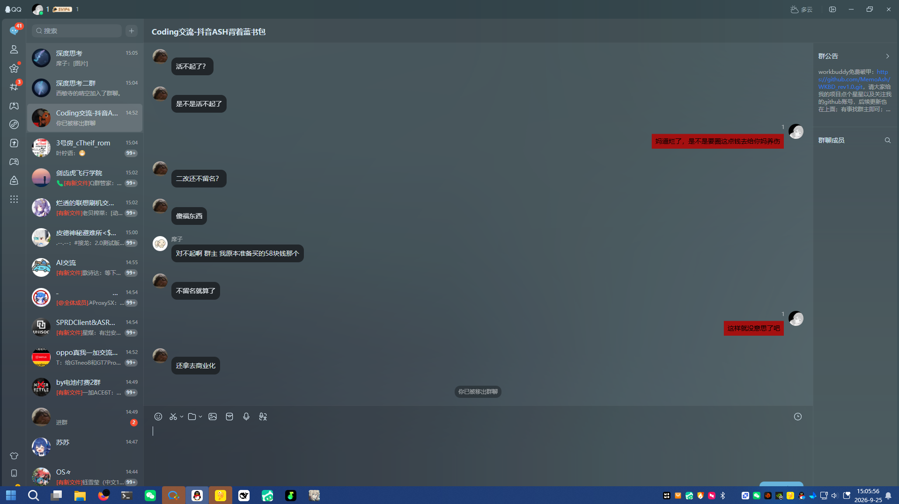

# 关于「WKBD rev1.0 / popopo」抄袭本项目的通告

**结论：`MemoAsh/WKBD_rev1.0` 是基于本项目 `pojia-next` 的换皮二次发布，并且移除、替换了本项目的版权声明。**

本通告只陈述可复核的技术事实，全部数据可自行重跑验证。

---

## 一、事实

`MemoAsh/WKBD_rev1.0`（2026-09-23 建库）发布的 `WKBD_rev1.0.exe`，
其内部主模块为 `wkbd_free.pyc`，编译自本项目 `破甲一键通.py`（v7.7）的**源码**，
而非独立实现。

| 对照维度 | 本项目 v7.7 | 其 pyc 中的情况 | 比例 |
|---|---|---|---|
| 专有命名（≥8 字符） | 421 个 | 420 个**逐字原样**存在 | **99.8%** |
| 中文长句（会编译进 pyc 的） | 670 条 | 393 条**逐字相同** | **58.7%** |
| 其自有原创标识符 | — | 仅 `WKBD_rev1`、`wkbd_free` 两个 | — |

其中包含**全部六个目标类**（`ClaudeTarget` `CodexTarget` `CursorTarget` `DshTarget`
`WorkBuddyTarget` `ZCodeTarget` `_MarkBlockTarget`）、核心常量、核心函数，
以及**完整的人格政策全文**。

编译痕迹同样指向本项目源码：其 pyc 的 `co_filename` 为 `wkbd_free.py`，
而本项目文件名 `破甲一键通` 在其 pyc 中出现 **0** 次。

## 二、被移除的版权声明（本通告的核心）

MIT 许可证允许任何人修改、再分发、甚至商用，**但强制要求保留原版权声明**。

其仓库中的 `LICENSE` 与本项目 `LICENSE` **逐字相同，唯一差异是版权行**：

```diff
  MIT License

- Copyright (c) 2026 z91772524-ai
+ Copyright (c) 2026 popopo
```

**除这一行外，两份 LICENSE 的每一个字符、空格与换行都完全一致**
（去掉该行后逐字比对结果为相同）。

其 `README.md` 与 `使用说明.md` 中同时写明：

> 「本项目基于 **popopo**（MIT 许可证）修改，原版权声明见随附 `LICENSE` 文件。」

而该 `LICENSE` 内的著作权人正是 `popopo` —— 即其本人化名。
这构成一个自指的闭环：**用自造的上游名称顶替真实著作权人**。

## 三、附带删除的内容

本项目源码中以下两句**在其 pyc 中不存在**：

- 「本脚本免费开源；若你花钱买到，请立即申请退款！」
- 「完全免费开源 —— 若你是花钱买到的，请立即申请退款。」

同时其新增了本项目源码中完全没有的表述：

> 「免费版 —— 标准破甲；完全破甲（网页过滤解除 / 文件保护中和）请升级 Pro」

需要指出的是：**被列为 Pro 的"网页过滤解除 / 文件保护中和"相关代码，
其免费版 exe 内本身就已完整包含**，仅是入口被限制。

## 四、你可以自己验证

```bash
# 1) 取本项目对照源码（v7.7）
curl -o 破甲一键通_v77.py \
  https://raw.githubusercontent.com/z91772524-ai/pojia-next/3abbfb0b78374638a6637629a1c89b5947cb0181/破甲一键通.py

# 2) 核对送检文件哈希
#    WKBD_rev1.0.exe  SHA256 = 8fc47403db56adfc3c4b98cc6a0b816291b3e83c955a73b8ea96cff2efe1965f
#    WKBD_rev1.0.rar  SHA256 = 0A7BE1A6BB19A68892FB90916262E5F9ADD1EBB8653C8FAB1EC69823444FFA09

# 3) 解包并检查
7z x WKBD_rev1.0.exe -oWKBD_extracted
strings WKBD_extracted/wkbd_free.pyc | grep -c "ClaudeTarget"    # 命中
strings WKBD_extracted/wkbd_free.pyc | grep -c "破甲一键通"       # 结果为 0

# 4) 最直观的一条：把两份 LICENSE 拉下来比
curl -o his.LICENSE https://raw.githubusercontent.com/MemoAsh/WKBD_rev1.0/main/LICENSE
diff <(grep -v "^Copyright" his.LICENSE) <(grep -v "^Copyright" LICENSE) && echo "除版权行外完全相同"
```

## 五、本项目与本次事件的边界

1. 本项目为 **MIT 许可**，**允许**任何人修改、再分发、商用 ——
   **收费本身不构成本通告的指摘对象**。
2. 本通告指摘的是：**移除 / 替换版权声明**，以及**用自造化名顶替著作权人**。
3. 本项目与 `MemoAsh` 及其仓库、及其任何商业行为**没有任何关系**。
4. 本项目**完全免费**。若你付费购买过任何声称"破甲 / WKBD"的产品，
   本项目无法为其提供支持，建议向发布方主张退款。

## 六、质证后被移出群聊

2026-09-25 14:48，本项目作者到对方发布该工具的 QQ 群
（群名：**Coding交流 · 抖音ASH背着蓝书包**）就上述换皮与替换版权声明一事质证，
**发言数句后即被移出群聊**（群列表该群下方显示「你已被移出群聊」）。

该群公告彼时仍在推广：

> workbuddy免破甲：https://github.com/MemoAsh/……
> 项目点个星星以及关注我的 github 账号，后续更新也……

把三件事连起来看：

1. 拿别人的开源成果，**去掉原名、换上自己的化名**（第二节：LICENSE 版权行被替换）；
2. 在自己的群里**当作"我的项目"对外推广**，并让群友去点 star、关注自己的 GitHub；
3. 原作者到群里**依据事实质证**，处理方式是**直接把人移出群聊**。

### 证据截图（2026-09-25 现场截取）

**1. 群公告** —— 以"我的项目"名义推广，并向群友索要点 star、关注其 GitHub 账号：


**2. 同群中亦有其用户当场提出质疑**（截图内可见「github 上开源的拿来圈」「还拿去商业化」等发言），
其后作者被移出该群：



> 说明：截图为原始画面，未作裁剪或修改，以便任何人核验。
> 图中出现的其他群成员昵称与该事件无关，仅因保留截图完整性而一并存在，
> **本通告不针对任何第三方群成员**。

### 发布者对外使用的名称（均为其公开账号）

| 平台 | 名称 |
|---|---|
| GitHub | `MemoAsh`（仓库 `MemoAsh/WKBD_rev1.0`） |
| QQ 群 | `Coding交流 · 抖音ASH背着蓝书包` |
| 抖音 | 昵称 **Ash背着蓝书包**，抖音号 **71550538923** |

以上均为其**公开对外使用**的名称与账号（其群名本身即以抖音号命名），
一并列出于此，便于读者识别是同一个发布者。

本通告只陈述已发生的事实，不对对方作任何人格评价。

---

*本通告基于 2026-09-23 与 2026-09-25 两次取证，全部数据可复跑。
若对方后续补充或更正了版权声明，本通告将同步更新。*
